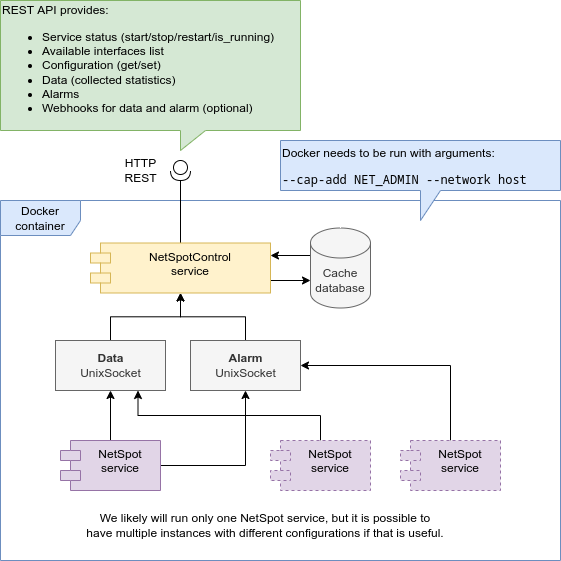

# WP4 netspot

[![LICENSE][license badge]][license] [![Actions Status][actions badge]][actions] [![CodeCov][codecov badge]][codecov]

This repository is for implementing SIFIS-Home WP4 Multi-Level Analysis using the SPOT algorithm. The solution is planned to run as a docker container where the controlling program provides HTTP REST API for other services. The controlling service is designed to run netspot programs and collect data to the cache database.

Below is initial plans for the service.



## Project folders

* *db – database location, when developing, can be changed from the .env file*
* docs – Documentation and plans
* migrations – Diesel migration scripts for the database schema
* src – Netspot Control service source files
  * api_v1 – Source files for the HTTP API version 1.x.x (and also 0.x.x while still in development)
  * state – Source files for shared state
  * structures – Source files for structures used between components

* static – Static files served by the Netspot Control server when run

## Netspot

We are planning to use the following Go Implementation of SPOT
https://github.com/asiffer/netspot

Python version of the algorithm is also available:
https://github.com/Amossys-team/SPOT

Project Page:
https://asiffer.github.io/netspot/

## Docker

Building docker file:

````bash
docker build --tag=netspot_control .
````

Running `netspot_control` with docker:

```bash
docker run --detach --name=netspot_control --cap-add=NET_ADMIN --network=host netspot_control
```

You can now stop container with:

```bash
docker stop netspot_control
```

And start it again with:

```bash
docker start netspot_control
```

Server is configured to listen port 80 by default. You should be able to connect with browser to: http://your-docker-host/

If you are running docker on local machine try opening: http://localhost/

For using another port add `--env=ROCKET_PORT=<port number>` to docker run command. For example:

```bash
docker run --detach --name=netspot_control --cap-add=NET_ADMIN --network=host --env=ROCKET_PORT=3000 netspot_control
```

### Database

Database is stored into the `/var/lib/netspot_control/` path in the container. This can be changed by adding `--env=DB_FILE_PATH=/my/custom/path` to docker arguments. However, that will only change the location inside the container and is not persistent. 

For a persistent database, we have two options: volumes and bind mounts.

See https://docs.docker.com/storage/ for more details.

#### Using volume

Create volume

```bash
docker volume create netspot_control_volume
```

Start container with the volume

```bash
docker run --detach --name=netspot_control --cap-add=NET_ADMIN --network=host \
--mount source=netspot_control_volume,target=/var/lib/netspot_control \
netspot_control
```

#### Bind mount

Start container with bind mount

```bash
docker run --detach --name=netspot_control --cap-add=NET_ADMIN --network=host \
-v /my/local/db/path:/var/lib/netspot_control \
netspot_control
```

## TODO

- [x] OpenAPI specification for the service
  - [x] Version 0.1.1 done — [yaml](docs/netspot-control-api.yaml) | [json](netspot_control/static/design/openapi.json)
  - [x] Available from the `netspot_control` service itself
- [x] Writing `netspot_control` application:
  - [x] Design of program parts and interactions
  - [ ] Structures
    - [x] Netspot configuration
      - [x] Making TOML configuration for netspot
    - [x] Status
    - [x] Statuses
    - [ ] Statistics
    - [ ] Webhook
    - [ ] Webhooks
  - [ ] Database handler
    - [x] Configuration endpoints
    - [ ] Statistics
    - [ ] Webhooks
  - [ ] NetspotProcess (WIP)
  - [ ] NetspotManager (WIP)
    - [ ] SocketListener
    - [ ] NetspotSocket
    - [x] Status endpoints
  - [ ] Webhooks
    - [ ] Webhook endpoints
  - [ ] CORS ?
  - [ ] Authorization ?
- [ ] WP2 Checklist
  - [ ] GitHub Action
    - [ ] Code coverage
    - [ ] Continous delivery
- [ ] Integration tests
- [ ] Example scripts

<!-- Links -->
[actions]: https://github.com/sifis-home/wp4-edge_ids/actions
[codecov]: https://codecov.io/gh/sifis-home/wp4-edge_ids
[license]: LICENSE

<!-- Badges -->
[actions badge]: https://github.com/sifis-home/wp4-edge_ids/workflows/netspot_control/badge.svg
[codecov badge]: https://codecov.io/gh/sifis-home/wp4-edge_ids/branch/master/graph/badge.svg
[license badge]: https://img.shields.io/badge/license-MIT-blue.svg
